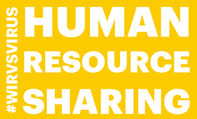

# Human Resource Sharing

Durch die Corona-Krise fallen in zahlreichen Wirtschaftszweigen Jobs weg und Menschen verlieren ihre Arbeit.
Auf der anderen Seite werden im Gesundheitswesen und in der Ernte händeringend Helfer gesucht.
Lokale Unternehmen benötigen außerdem ganz neue Kompetenzen, um ihr Angebot auf Lieferservices und Online-Angebot
umzustellen.

**Human Resource Sharing** ist die Plattform, die kleinen und mittelständigen Unternehmen hilft,
schnell und unbürokratisch helfende Hände zu finden, von ausgebildeten Fachkräften
über temporäre Aushilfen bis hin zu Ehrenamtlichen.

Weitere Informationen zur Anwendung und dem Team sind eingestellt auf

https://devpost.com/software/16_lokaleunternehmen_human_resource_sharing

Eine Testversion der Anwendung ist unter

https://humanresourcesharing.herokuapp.com/pages/welcome

erreichbar.

Diese Anwendung ist im Rahmen des WirVsVirus-Hackathons vom 20.03. bis 22.03.2020 entstanden.

